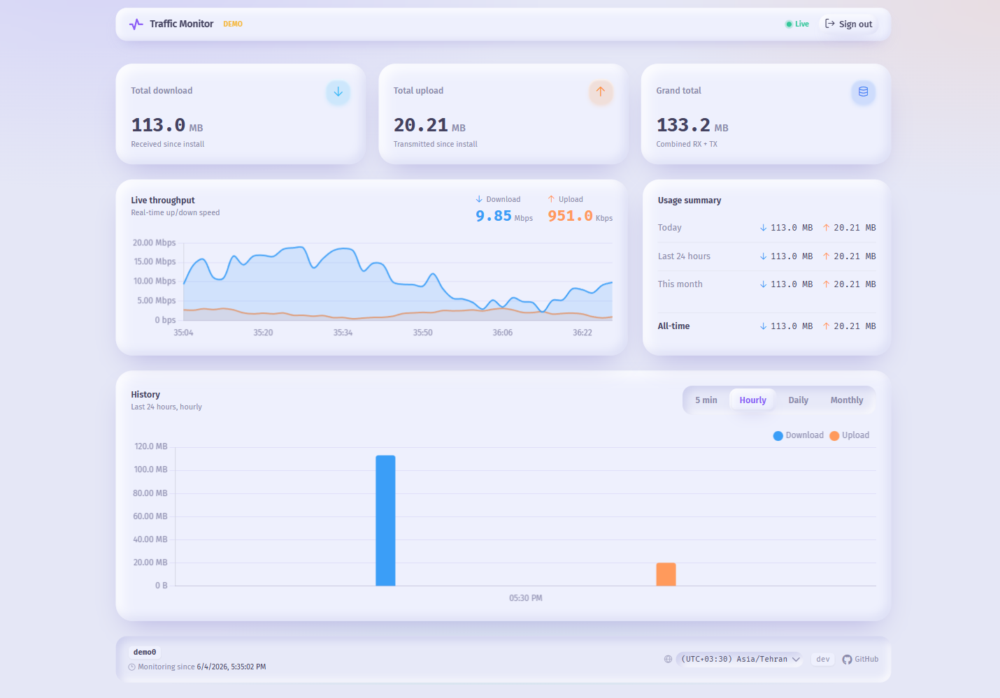
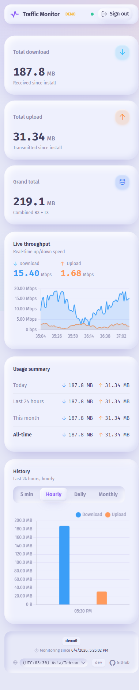

# Traffic-monitor

A self-hosted, **extremely lightweight** network-traffic monitor for a single network
interface on Ubuntu/Linux. It ships as **one static binary** that embeds its web UI and
serves both the JSON API and the dashboard on a single port — no separate frontend server,
no CORS, no runtime dependencies.



## Features

- **Cumulative forever.** Tracks total RX / TX / combined bytes since the moment of
  installation — multi-terabyte correct (uint64 counters end-to-end, byte counts sent as strings so the
  browser keeps them exact) — and **keeps accumulating across reboots**.
- **Lossless across reboots, restarts, and crashes.** A durable raw-counter anchor plus kernel
  `boot_id` detection means bytes are never lost or double-counted: reboots are detected
  exactly (independent of counter magnitude), service downtime is recovered, and a crash never
  loses more than the in-memory window.
- **Full long-term history.** Per-hour data kept *forever*, 5-minute resolution for the last
  24 hours, and daily/monthly views derived on read — far more complete than `vnstat`'s
  ~30-day window.
- **Professional dashboard.** Real-time throughput chart (Server-Sent Events), cumulative
  total cards, a live usage summary (today / 24h / month / all-time), and hourly/daily/monthly
  history bars. Soft claymorphism look, fully responsive (mobile to large
  screens), keyboard-accessible. A footer timezone selector controls how every
  timestamp is displayed (defaults to `Asia/Tehran`).
- **Tiny footprint.** Pure-Go, near-zero idle CPU/RAM, a single SQLite file (WAL, one tiny
  write per minute), and a ~16 MB static binary that opens fast.
- **Secure by default.** Single admin, bcrypt password hash, HMAC-signed session cookie,
  login rate-limiting, and a hardened systemd unit running as a dedicated non-root user.

## Tech stack

| Layer | Choice |
|-------|--------|
| Backend | Go, single static `linux/amd64` binary (`CGO_ENABLED=0`) |
| Storage | SQLite via pure-Go `modernc.org/sqlite` (WAL) |
| Frontend | Nuxt 3 (SPA) + Tailwind CSS + PrimeVue v4 + Chart.js |
| Packaging | Frontend embedded into the binary with `//go:embed` |
| Service | systemd (auto-start, restart on failure) |

Backend runtime dependencies are only `modernc.org/sqlite` and `golang.org/x/crypto`;
everything else is the Go standard library.

## Architecture

A single goroutine polls `/sys/class/net/<iface>/statistics/{rx,tx}_bytes` every 2 seconds,
keeps recent samples in an in-memory ring (for the live chart) and a running cumulative total,
and flushes deltas to SQLite once a minute in one atomic transaction (totals + time buckets +
the durable recovery anchor move together). The HTTP server (stdlib `net/http`) serves the
JSON/SSE API under `/api` and the embedded SPA on every other path.

See [the engine source](backend/internal/engine/engine.go) for the accounting algorithm and
[its tests](backend/internal/engine/engine_test.go) for the reboot/restart/crash guarantees.

## Build

Requires Go 1.23+ and Node 20.19+ or 22.12+ (Node 22 recommended — it's what CI uses).

```bash
# one-shot: build the frontend, embed it, and produce ./Traffic-monitor-amd64
scripts/build.sh v1.0.0          # Linux/macOS
# or
scripts\build.ps1 v1.0.0         # Windows (cross-compiles a linux/amd64 ELF)
```

The script runs `nuxt generate`, copies the static output into `backend/web/public`, and
builds the static binary with the frontend embedded (`//go:embed all:public`). It restores the
embed directory afterwards so the working tree stays clean.

> The binary cross-compiles from any OS because `modernc.org/sqlite` is pure Go and the build
> uses `CGO_ENABLED=0`.

## Local development

The fastest loop is the Go server in demo mode (synthetic traffic, works on any OS) plus the
Nuxt dev server (hot reload, proxies `/api` to the backend):

```bash
# terminal 1 — backend with synthetic data and a dev password
cd backend
go run ./cmd/traffic-monitor set-password -db ./dev.db -password admin
go run ./cmd/traffic-monitor serve -demo -db ./dev.db -listen 127.0.0.1:8088

# terminal 2 — frontend dev server (http://localhost:3000)
cd frontend
npm install
npm run dev
```

`-demo` makes the engine synthesize realistic up/down traffic, so the whole dashboard renders
without a real interface (or on Windows/macOS).

> **Note:** `npm run dev` (the Nuxt dev server) currently fails to start with the pinned
> toolchain — a Vite 7 / Nuxt 3.21 incompatibility (`No entry found in rollupOptions.input`).
> Until it's fixed, build the static UI with `npm run generate` and serve it through the Go
> binary (`scripts/build.sh` / `build.ps1` embed it), rebuilding to see changes.

## Contributing

CI runs on every push and pull request and must pass before a release tag is cut. To match it
locally, from `backend/`:

```bash
gofmt -l .          # must print nothing — the tree must stay gofmt-clean
go vet ./...
go test ./...
CGO_ENABLED=0 GOOS=linux GOARCH=amd64 go build ./...
```

The frontend job builds the SPA with `npm run generate` on Node 22. See
[`.github/workflows/ci.yml`](.github/workflows/ci.yml).

## Release flow

Push a version tag and GitHub Actions does the rest:

```bash
git tag v1.0.0
git push origin v1.0.0
```

The [release workflow](.github/workflows/release.yml) builds the frontend, embeds it, builds
`Traffic-monitor-amd64`, and publishes a GitHub Release with **both** `Traffic-monitor-amd64`
and `install.sh` attached.

## Install on a server

On the Ubuntu server, place the two files:

- `install.sh` at `/root/install.sh`
- the built binary at `/tmp/Traffic-monitor-amd64`

(both are attached to every GitHub Release), then:

```bash
# Install: auto-picks a random free 5-digit port and a secret web path;
# prompts for the interface and admin password.
bash /root/install.sh install

# Update to a new binary — replace /tmp/Traffic-monitor-amd64 first.
# Keeps the database, port, and secret path; only swaps the binary and restarts.
bash /root/install.sh update

# Change the admin password
bash /root/install.sh reset-password

# Change or regenerate the secret web path
bash /root/install.sh set-web-path             # regenerate a random one
bash /root/install.sh set-web-path my-secret   # set it explicitly

# Remove the service (asks whether to also delete the database/config)
bash /root/install.sh uninstall

# Or run with no arguments for an interactive menu
bash /root/install.sh
```

`install` creates a dedicated `traffic-monitor` system user, the data directory
`/var/lib/traffic-monitor`, the config `/etc/traffic-monitor/traffic-monitor.env`, and a
hardened systemd service that auto-starts on boot and restarts on failure. It also picks a
**random free 5-digit port** and a **random secret web path**, then prints the full URL to
open — e.g. `http://<server-ip>:53124/8f3a9c1d2e5b7a04/`.

The **entire app (UI, API, login, SSE) is served only under that secret path**; the root URL
and any wrong path return **404** (the app's existence isn't revealed). The port and secret
path are persistent — `update` and a repeat `install` keep them.

Non-interactive install / overrides:

```bash
bash /root/install.sh install \
  --interface eth0 --port 53124 --web-path my-secret --password 'your-password'
```

`--bind ADDR` additionally overrides the listen address (default `0.0.0.0`; e.g. `127.0.0.1`
to bind localhost only).

## Configuration

The service reads environment variables (written by `install.sh` into the systemd
`EnvironmentFile`). Command-line flags on `serve` override them.

| Variable | Flag | Default | Meaning |
|----------|------|---------|---------|
| `TM_LISTEN` | `-listen` | `0.0.0.0:8088` | listen address `host:port` (installer uses a random 5-digit port) |
| `TM_BASE_PATH` | `-base-path` | `/` (root) | secret base path the whole app is served under |
| `TM_INTERFACE` | `-iface` | auto (default route) | interface to monitor |
| `TM_DB` | `-db` | `traffic.db` | SQLite database path (installer writes `/var/lib/traffic-monitor/traffic.db`) |
| `TM_TZ` | `-tz` | system local | timezone for day/month aggregation |
| `TM_POLL_INTERVAL` | `-poll` | `2s` | live sampling interval |
| `TM_FLUSH_INTERVAL` | `-flush` | `60s` | database flush interval |
| `TM_SESSION_TTL` | `-session-ttl` | `168h` | session cookie lifetime |
| `TM_COOKIE_SECURE` | `-cookie-secure` | `auto` | `Secure` cookie flag: `auto`/`true`/`false` |
| `TM_TRUST_PROXY` | `-trust-proxy` | `false` | trust `X-Forwarded-For` for the client IP (enable **only** behind a trusted reverse proxy) |
| `TM_DEMO` | `-demo` | `false` | synthetic counters (development) |

## API reference

All endpoints are served under the configured secret base path (shown below as `/api/...` for
the root case). Everything except `login`, `logout`, `session`, and `version` requires a valid
session cookie. Byte counts are returned as decimal **strings** (BigInt-safe); speeds are
numbers in **bits/second**.

| Method & path | Description |
|---------------|-------------|
| `POST /api/login` | `{ "password": "..." }` → sets the session cookie |
| `POST /api/logout` | clears the session cookie |
| `GET /api/session` | `{ authenticated, password_configured }` |
| `GET /api/version` | build version |
| `GET /api/totals` | cumulative RX/TX/total + install/last-update timestamps |
| `GET /api/live` | latest live sample `{ ts, rx_bps, tx_bps }` |
| `GET /api/live/recent` | recent samples (seeds the live chart) |
| `GET /api/live/stream` | Server-Sent Events stream of live samples (authorized at connect; closes when the session expires) |
| `GET /api/history?range=5min\|hour\|day\|month&count=N` | time-bucketed history |
| `GET /api/interface` | interface info + current speed |
| `GET /api/summary` | today / last 24h / this month / all-time totals |

## Security notes

- **Random port + secret web path.** The installer listens on a random 5-digit port and serves
  the whole app under a random secret path. Nothing is reachable at the root — `/` and any
  wrong path return 404, so a scanner can't tell the app exists without the exact path. This is
  obscurity, not a replacement for the password; keep both.
- The panel serves plain HTTP. Expose it only on a trusted LAN/VPN, or place it behind a
  reverse proxy that terminates TLS. Set `TM_COOKIE_SECURE=true` (or rely on `auto`, which
  enables it when the request arrives over HTTPS) when behind TLS. The session cookie is scoped
  to the secret base path.
- 5-digit ports need no privileges; the systemd unit only grants `CAP_NET_BIND_SERVICE` if you
  override to a port below 1024.
- The admin password is stored as a bcrypt hash in the SQLite database; the session secret is
  generated on first run and persisted, so sessions survive restarts. `set-web-path` also
  rotates the session secret, immediately invalidating any outstanding tokens. The binary
  exposes this directly as a `rotate-secret` subcommand
  (`traffic-monitor rotate-secret -db <path>`) to force every session to log out without
  changing the path.
- The login rate limiter keys on the connecting peer IP and **ignores `X-Forwarded-For` by
  default** so a directly-exposed server can't be bypassed with a spoofed header. Set
  `TM_TRUST_PROXY=true` only when a trusted reverse proxy sets the header.

### Known limitation

Day and month boundaries are accurate to the UTC hour. For timezones with a non-whole-hour
offset (e.g. India +5:30, Nepal +5:45), the single hour that straddles local midnight is
attributed to one side, so the "today"/"this month" edge can be off by up to that fractional
hour. Long-window totals are exact.

The footer timezone selector only changes how times are *displayed*; day and month buckets are
still grouped server-side by `TM_TZ`. For day/month labels that line up exactly with the
buckets, set `TM_TZ` to the same zone you view in.

## Screenshots

| Desktop | Mobile |
|---------|--------|
|  |  |

## License

[MIT](./LICENSE)
